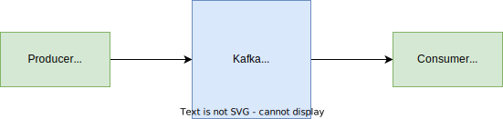

# Kafka

Apache Kafka is a distributed event store and stream-processing platform. 
The project aims to provide a unified, high-throughput,
low-latency platform for handling real-time data feeds. Kafka can connect to external systems (for data import/export)
via Kafka Connect, and provides the Kafka Streams libraries for stream processing applications. Kafka uses a binary
TCP-based protocol that is optimized for efficiency and relies on a "message set" abstraction that naturally groups
messages together to reduce the overhead of the network roundtrip.

### Build, Run, Test, UI
```
cd producer-service
./gradlew clean build
cd consumer-service
./gradlew clean build
docker-compose up -d
```

#### UI
```
http://localhost:8080/
```

### Diagram


### TODO
- [ ] Kafka Docker image
- [ ] Kafka Connect
- [ ] Autoscaling
- [ ] Multiple instances
- [ ] Consumer Service
- [ ] Producer Service
- [ ] Protobuf messages

### Use cases
- https://kafka.apache.org/powered-by

### References
- https://kafka.apache.org/
- https://hub.docker.com/r/bitnami/kafka
- https://github.com/apache/kafka/blob/trunk/docker/examples/README.md
- https://github.com/provectus/kafka-ui
- https://docs.confluent.io/platform/current/connect/index.html#how-kafka-connect-works
- https://docs.confluent.io/platform/current/schema-registry/index.html#schemas-subjects-and-topics
- https://github.com/provectus/kafka-ui/blob/master/documentation/compose/kafka-with-zookeeper.yaml