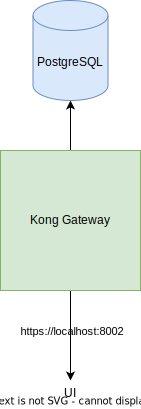

# Kong Gateway

An open-source API gateway.

### Functional Requirements
- Telemetry
- Authentication
- Load Balancer
- Rate Limiter
- Routing Engine

### Non-Functional Requirements
- Availability & SLOs

### Stats

### Build, Run, Test, UI
```
docker-compose up kong-database-prepare -d
docker-compose up
```

#### UI
```
http://localhost:8082/
```

### Diagram


### TODO
- [ ] Add Services and Routes https://docs.konghq.com/gateway/3.6.x/get-started/services-and-routes/
- [ ] Add Rate Limiter https://docs.konghq.com/gateway/3.6.x/get-started/rate-limiting/
- [ ] Add Proxy Caching https://docs.konghq.com/gateway/3.6.x/get-started/proxy-caching/
- [ ] Add Authentication https://docs.konghq.com/gateway/3.6.x/get-started/key-authentication/
- [ ] Add Stats and Real examples with QPS and so on
- [ ] Add Load Balancing https://docs.konghq.com/gateway/3.6.x/get-started/load-balancing/

### References
- https://konghq.com/products/kong-gateway
- https://github.com/Kong/docker-kong/blob/master/compose/docker-compose.yml
- https://hub.docker.com/_/kong
- https://hub.docker.com/r/kong/kong-gateway
- https://docs.konghq.com/gateway/3.6.x/install/docker/?install=oss